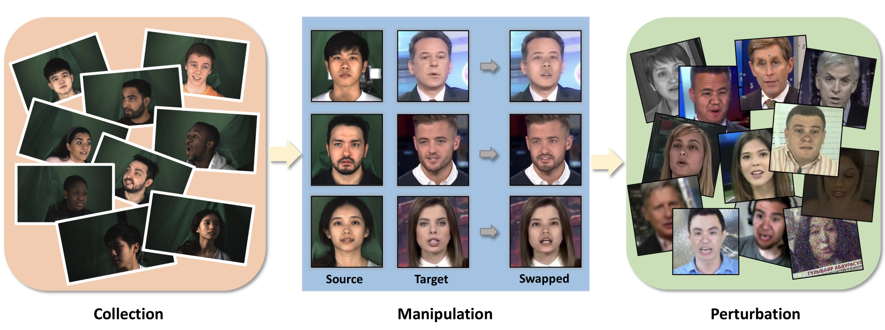

# DeeperForensics-1.0: A Large-Scale Dataset for Real-World Face Forgery Detection



This repository provides the dataset and code for the following paper:

**DeeperForensics-1.0: A Large-Scale Dataset for Real-World Face Forgery Detection**<br>
[Liming Jiang](https://liming-jiang.com/),  [Ren Li](https://liren2515.github.io/page/), [Wayne Wu](http://wywu.github.io), [Chen Qian](https://scholar.google.com/citations?user=AerkT0YAAAAJ&hl=en)  and [Chen Change Loy](http://personal.ie.cuhk.edu.hk/~ccloy/)<br>
In CVPR 2020.<br>
[**Project Page**](https://liming-jiang.com/projects/DrF1/DrF1.html) |   [**Paper**](https://arxiv.org/abs/2001.03024) | [**YouTube Demo**](https://www.youtube.com/watch?v=b6iKqkJht38)
> **Abstract:** *In this paper, we present our on-going effort of constructing a large-scale benchmark, DeeperForensics-1.0, for face forgery detection. Our benchmark represents the largest face forgery detection dataset by far, with 60, 000 videos constituted by a total of 17.6 million frames, 10 times larger than existing datasets of the same kind. Extensive real-world perturbations are applied to obtain a more challenging benchmark of larger scale and higher diversity. All source videos in DeeperForensics-1.0 are carefully collected, and fake videos are generated by a newly proposed end-to-end face swapping framework. The quality of generated videos outperforms those in existing datasets, validated by user studies. The benchmark features a hidden test set, which contains manipulated videos achieving high deceptive scores in human evaluations. We further contribute a comprehensive study that evaluates five representative detection baselines and make a thorough analysis of different settings. We believe this dataset will contribute to real-world face forgery detection research.*


## Updates
- [08/2020] The [**DeeperForensics Challenge 2020**](https://competitions.codalab.org/competitions/25228) will start together with [ECCV 2020 SenseHuman Workshop](https://sense-human.github.io/).

- [05/2020] The [perturbation codes](./perturbation) of DeeperForensics-1.0 are **released**.

- [05/2020] The [dataset](./dataset) of DeeperForensics-1.0 is **released**.

- [02/2020] The [paper](https://arxiv.org/abs/2001.03024) of DeeperForensics-1.0 is accepted by **CVPR 2020**.

## Competition
:fire::fire: We are now hosting [**DeeperForensics Challenge 2020**](https://competitions.codalab.org/competitions/25228) based on the DeeperForensics-1.0 dataset. The challenge has officially started at the [ECCV 2020 SenseHuman Workshop](https://sense-human.github.io/). The prizes of the challenge will be a total of $15,000 ([AWS](https://aws.amazon.com/) promotion code). [Registration](https://competitions.codalab.org/competitions/25228#participate) is still open. If you are interested in soliciting new ideas to advance the state of the art in real-world face forgery detection, we look forward to your participation!

## Dataset
DeeperForensics-1.0 dataset has been made **publicly available** for non-commercial research
purposes. Please visit the [dataset download and document page](./dataset) for more details.
Before using DeeperForensics-1.0 dataset for face forgery detection model training,
please read these [important tips](./dataset/README.md#target-videos) first.

## Code
The code to implement the diverse perturbations in our dataset has been **released**. Please
see the [perturbation implementation](./perturbation) for more details.

## Summary
### Data Collection
We invite 100 paid actors from 26 countries to record the source videos. Our high-quality collected data vary in identities, poses, expressions, emotions, lighting conditions, and 3DMM blendshapes.
<p align="center">
  
</p>

### Face Manipulation
We also propose a new learning-based **many-to-many** face swapping method,
 **DeepFake Variational Auto-Encoder (DF-VAE)**. DF-VAE improves *scalability*,
  *style matching*, and *temporal continuity* to ensure face swapping **quality**.
<p align="center">
  
</p>

Several face manipulation results:
<p align="center">
  
</p>

Many-to-many (three-to-three) face swapping by a **single** model:
<p align="center">
  
</p>

### Real-World Perturbation
We apply 7 types (transmission errors, compression, *etc.*) of distortions
at 5 intensity levels. Some videos are subjected to a mixture of more than
one distortion. These perturbations make DeeperForensics-1.0 better simulate
real-world scenarios.
<p align="center">
  
</p>

### Benchmark
We benchmark five representative forgery detection methods
using the DeeperForensics-1.0 dataset. Please refer to our [paper](https://arxiv.org/abs/2001.03024)
for more information.


## Citation
If you find this work useful for your research, please cite our paper:

```
@inproceedings{jiang2020deeperforensics10,
  title={DeeperForensics-1.0: A Large-Scale Dataset for Real-World Face Forgery Detection},
  author={Jiang, Liming and Li, Ren and Wu, Wayne and Qian, Chen and Loy, Chen Change},
  booktitle={CVPR},
  year={2020}
}
```

## Acknowledgments
We gratefully acknowledge the exceptional help from Hao Zhu and Keqiang Sun for their contribution on source data collection and coordination.

## Contact
If you have any questions, please contact us by sending an email to
[deeperforensics@gmail.com](mailto:deeperforensics@gmail.com).

## Terms of Use
The use of DeeperForensics-1.0 is bounded by the [Terms of Use: DeeperForensics-1.0 Dataset](./dataset/Terms_of_Use.pdf). \
The code is released under the [MIT license](./perturbation/LICENSE.md).

Copyright (c) 2020
